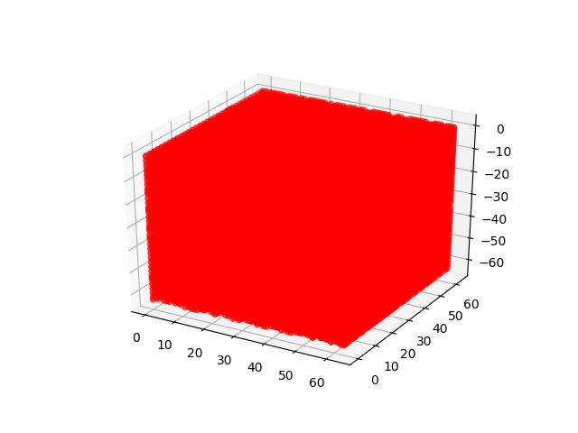

# Generating Shapes Using 3DGAN

## Dataset

This project use [3D ShapeNets](http://3dshapenets.cs.princeton.edu/3DShapeNetsCode.zip) dataset, which consists of 
properly annotated 3D shapes for 40 object categories. 

## Project structure

* __3DShapeNetsCode/__
    - __3DShapeNets/__
* __logs/__
* __models/__
* __results/__
* __Run3DGAN.py__

## How to run

1. __Step 1__: Preparation

Download the dataset and extract to the root path of our project

2. __Step 2__: Run our program 

```
python Run3DGAN.py
```

## Demo

